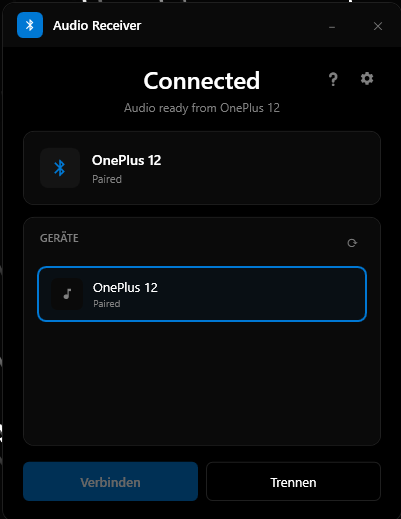

# Bluetooth Audio Receiver

<p align="center">
  
  
  
</p>

A modern Windows app that turns your PC into a Bluetooth speaker. Stream audio from your phone directly to your PC.

## ✨ Features

- **🎵 Bluetooth A2DP Sink** - Receive audio from any Bluetooth device
- **🌙 AMOLED Dark Theme** - Pure black design, easy on the eyes
- **📌 System Tray** - Runs quietly in the background
- **⚡ Low Overhead** - Event-driven, no polling, minimal resource usage
- **🚀 Autostart** - Optional startup with Windows (minimized mode available)
- **❓ Built-in Help** - Troubleshooting guide for common issues

## 📸 Screenshot



## 🔧 Requirements

- Windows 10 (Version 2004+) or Windows 11
- Bluetooth adapter with A2DP support
- A paired Bluetooth device (phone, tablet, etc.)

## 📥 Installation

1. Download the latest release from [Releases](../../releases)
2. Run `BluetoothAudioReceiver.exe`
3. Pair your phone via Windows Bluetooth settings
4. Select your device and click "Verbinden"

> ⚠️ **Windows SmartScreen Warning:** Since the app isn't code-signed, Windows may show a warning. Click "More info" → "Run anyway" to start the app. This is normal for open-source software.

## 🛠️ Building from Source

```bash
# Clone the repository
git clone https://github.com/Noxy/BluetoothAudioReceiver.git

# Navigate to project
cd BluetoothAudioReceiver

# Build
dotnet build

# Run
dotnet run

# Publish standalone exe
dotnet publish -c Release --self-contained true -p:PublishSingleFile=true
```

## ⚠️ Known Issues

### WiFi Slowdown
Bluetooth and WiFi often share the 2.4 GHz frequency band, causing interference.

**Solutions:**
- Use 5 GHz WiFi (best option)
- Device Manager → WiFi adapter → Properties → Disable "Bluetooth Collaboration"
- Use a separate USB Bluetooth dongle

## 📄 License

MIT License - feel free to use this project however you like.

## 🤝 Contributing

Pull requests are welcome! For major changes, please open an issue first.
